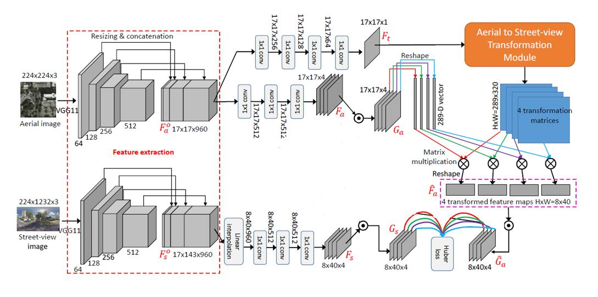

we proposean end-to-end convolutional neural network (CNNs)architecture, termed NAdir-view to Street-view NETwork (NaSNet), to learn a transformation between street-view
 and overhead-view images. The network extracts features from both street-view and aerial images and learns adaptive transformation matrices to map the aerial image feature
 maps to the corresponding street-view image feature maps. The pixel-wise difference between the transformed feature maps and the “ground truth” feature maps, which are directly
 extracted from the matching street-view images, are minimized using the Huber loss.

## Network Architecture


## Requirements
- Python2.7
- NumPy
- [Tensorflow](https://github.com/tensorflow/tensorflow)>=1.4
- scipy

## Experiment Dataset

- CVUSA datset: a dataset in America, with pairs of ground-level images and satellite images. All ground-level images are panoramic images.  
	The dataset can be accessed from https://github.com/viibridges/crossnet

## Running
------------
Training:
```bash
$ python main.py
```
